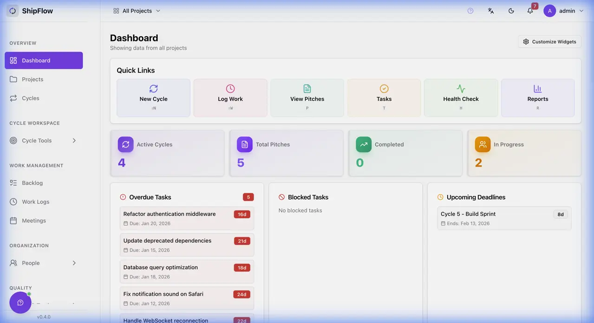
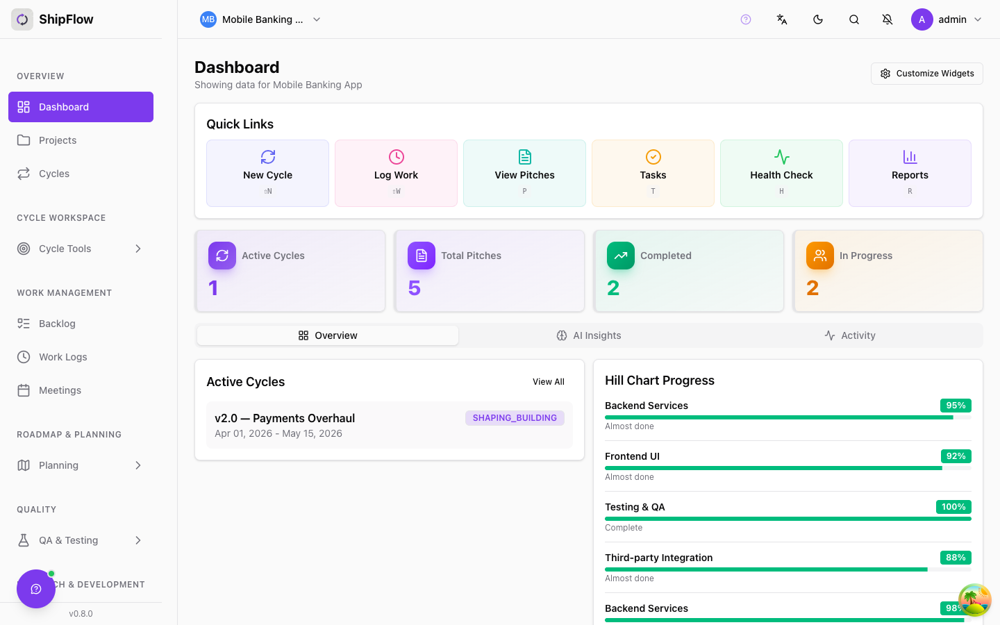
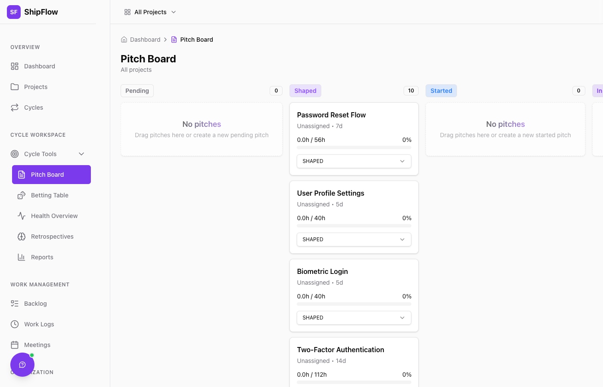
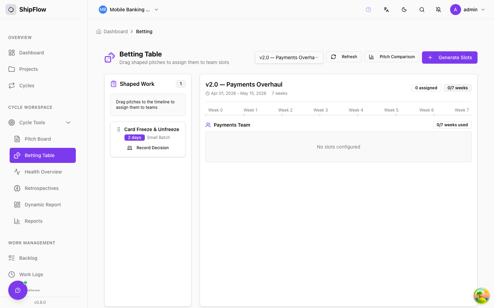
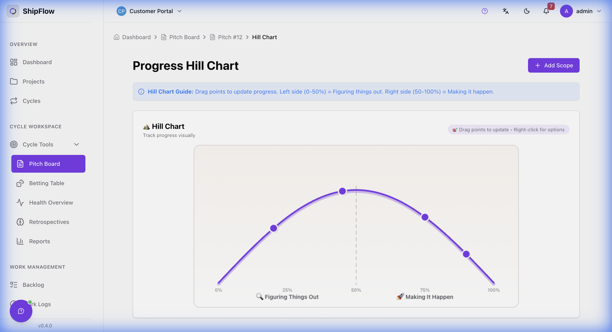
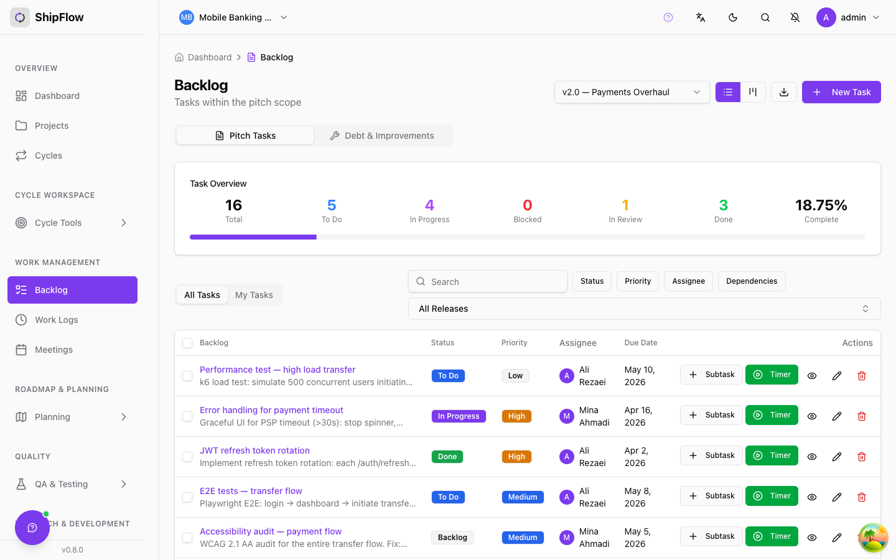
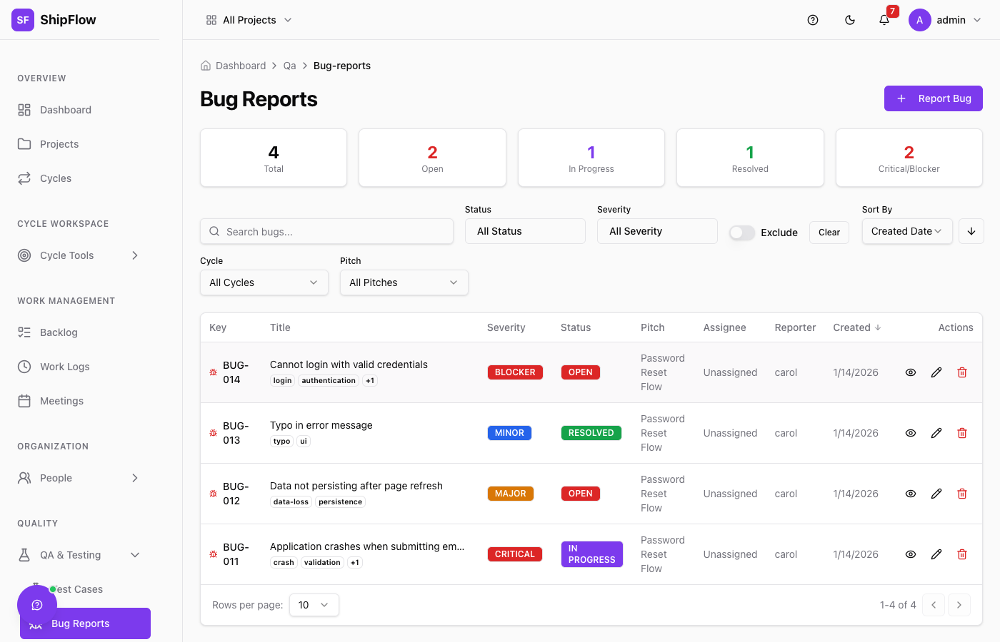

#  ShipFlow

**Open-source project management built for the [Shape Up](https://basecamp.com/shapeup) methodology** — with full Kanban and Scrum support, pluggable AI, and an MCP server so your AI coding assistant can query your board directly.

🌐 **Live Demo**: [shipflow.dev](https://shipflow.dev) &nbsp;|&nbsp; 📖 **Docs**: [farzad-sedaghatbin.github.io/ShipFlow](https://farzad-sedaghatbin.github.io/ShipFlow/) &nbsp;|&nbsp; ⭐ **Star us on GitHub**

---

## 🚀 Run in 30 seconds

```bash
git clone https://github.com/farzad-sedaghatbin/ShipFlow.git && cd ShipFlow
docker compose up -d
```

> Open **http://localhost:8080** — React app is bundled into the backend image. Login: `admin` / `admin123`
>
> Seed data loads automatically — two demo projects (Shape Up + Kanban), five users, full task history, AI-ready.
> Set `AI_PROVIDER=openai` and `APP_AI_OPENAI_API_KEY=sk-…` in a `.env` file to enable AI features.

---

## 📸 Screenshots



| Dashboard | Pitch Board | Betting Table |
|-----------|-------------|---------------|
|  |  |  |

| Hill Chart | Task Backlog | Bug Reports |
|------------|--------------|-------------|
|  |  |  |

---

## ✨ Feature Highlights

| | |
|---|---|
| **Triple project modes** | Shape Up (pitches, betting, hill charts, circuit breaker), Kanban, and Scrum (story points, burndown, velocity) — per project, switchable any time |
| **MCP server** | Claude Code, Cursor, and any MCP client can call `list_projects`, `get_work_context`, `create_task`, and 18 other tools — no browser tab switching |
| **Pluggable AI stack** | Swap between Ollama (local), OpenAI, Anthropic Claude, or RunPod via one env var. RAG Q&A, risk scoring, test generation, and technical solutions all work with every provider |
| **Hill charts** | Drag scopes along a sigmoid curve to show progress from "figuring it out" to "making it happen" — linked to task completion in real time |
| **Sprint planning** | Two-column drag-and-drop board, story-point totals, burndown vs ideal, and cross-sprint velocity chart |
| **Competitor import** | Upload a Jira, Linear, or Asana CSV — format is auto-detected, tasks/epics/sprints mapped into a new Kanban project |
| **GitHub integration** | Auto-link commits and PRs to tasks; auto-close on merge; webhook-driven timeline on every task |
| **Full audit trail** | Hibernate Envers versions every entity change; Jira-style activity timeline on tasks and bugs |
| **Enterprise-ready** | RBAC (6 roles), Slack/Teams notifications, SSE real-time events, rate limiting, ETag + Redis + React Query caching |
| **Self-hosted & free** | MIT licence, Docker Compose in one command, PostgreSQL + Redis, full data ownership |

---

## Demo Credentials

| Username | Password | Role |
|----------|----------|------|
| `admin` | `admin123` | Admin — full access |
| `sara` | `demo123` | Manager — Mobile Banking App |
| `ali` | `demo123` | Developer |
| `mina` | `demo123` | Developer |
| `viewer` | `demo123` | Read-only |

---

## ✨ Full Feature Reference

- **Triple Project Modes**: Flexible support for different project methodologies
  - **Shape Up Mode**: 6-week cycle methodology with pitches, betting, hill charts
  - **Kanban Mode**: Continuous flow with board-first visualization
  - **Scrum Mode** (v1.1.0): Sprint planning with story points, burndown charts, and team velocity tracking
  - Automatic UI adaptation based on project type (cycles hidden for Kanban; sprint goal/story points surfaced for Scrum)
  - Default "Continuous Flow" cycle created automatically for Kanban projects
  - Pitch and scope fields hidden in Kanban/Scrum projects (Shape Up concepts)
- **Cycles**: 6-week development cycles with betting table (Shape Up projects)
  - **Auto-Calculated Cycle Dates**: End dates automatically calculated from organization settings
    - Default 6-week cycles aligned with Shape Up methodology
    - Configurable cycle length in Organization Settings (4-12 weeks)
    - Role-based override: ADMIN and PROJECT_MANAGER can set custom cycle lengths
    - Regular users (DEVELOPER, QA, PRODUCT) use auto-calculated dates
    - Prevents configuration conflicts and ensures standardized planning horizons
- **Pitches**: Shape work with appetite, problem definition, and solution
  - **Shape Up Methodology Support**: Comprehensive pitch creation with all Shape Up elements
    - Problem Statement, Solution, Rabbit Holes, Risks, No-Gos, Wireframe Links
    - AI-powered pitch document extraction from PDF/DOCX/TXT files
    - Automatic knowledge base indexing for Q&A
    - Document upload, preview, and download capabilities
    - Inline editing of Shape Up fields on pitch detail page
  - **Pre-Cycle Workflow**: True Shape Up pitch lifecycle
    - Pre-cycle statuses: IDEA → DRAFT → SHAPED (no cycle required)
    - Betting candidates: shaped pitches automatically appear in betting table
    - Cycle assignment: betting assigns shaped pitches to cycles (SHAPED → PENDING)
    - Full support for pitches at every lifecycle stage
- **Hill Charts**: Visual progress tracking with drag-and-drop dots
- **Tasks**: Independent work management during cycles
  - **Scope-Task Auto-Bridge**: Unified workflow for scopes and tasks
    - Creating a root task with a pitch automatically creates a linked scope on the hill chart
    - Creating a scope automatically creates a corresponding task for work assignment
    - Auto-progress: scope position automatically syncs with subtask completion (0-100%)
    - Manual override: dragging a scope disables auto-progress (user control)
    - Toggle auto-progress on/off to restore automatic synchronization
    - Visual indicators show auto-progress status, linked relationships, and suggested positions
    - Event-driven real-time sync when task statuses change
    - Simplifies workflow: one action creates both trackable work item and hill chart visualization
  - **Traceability**: Optional links to pitches and scopes for improved reporting
    - Tasks can optionally link to specific pitch and scope (hill chart point)
    - Supports technical debt and improvement work (no pitch required)
    - Server-side search with debouncing for scalable scope/task selection
    - Minimum 3-character search prevents performance issues with large datasets
  - **Task Dependencies**: Lightweight dependency tracking to identify blockers
    - Three dependency types: BLOCKS, DEPENDS_ON, RELATED_TO
    - Automatic circular dependency detection using depth-first search
    - Visual blocker indicators in task lists and detail pages
    - Same-cycle validation for dependency relationships
    - Clean UI for adding/removing dependencies
    - See [Task Dependencies Guide](TASK_DEPENDENCIES.md) for details
  - **Soft Delete**: Safe deletion with recovery options
    - Records are marked as deleted, not permanently removed
    - Complete audit trail with deletion timestamp and user tracking
    - Data can be restored if needed while maintaining referential integrity
    - Available for pitches, tasks, and test cases with role-based permissions
- **Document Management**: Upload, preview, and download project documents
  - Support for PDF, DOCX, DOC, TXT, and MD files
  - Text extraction from uploaded documents
  - Document preview with extracted text
  - Download with original filenames and proper Content-Type headers
  - Automatic indexing for AI-powered Q&A
- **Roadmap & Release Planning**: Strategic planning with Initiative → Epic → Pitch hierarchy
  - **Initiatives**: Strategic themes spanning multiple quarters (e.g., "Mobile Experience 2026")
    - Status tracking: DRAFT, PLANNED, IN_PROGRESS, COMPLETED, ON_HOLD, CANCELLED
    - Color-coded timeline visualization with target dates
    - Owner assignment and project association
    - **Priority weighting**: HIGH / MEDIUM / LOW business value labels
    - **Drag-and-drop reordering**: Sort initiatives by strategic priority
  - **Epics**: Large feature groups organizing related pitches (e.g., "Mobile Checkout Redesign")
    - Optional parent initiative for strategic alignment
    - Progress tracking from linked pitches
    - Flexible status management matching initiative workflow
    - **Priority weighting**: HIGH / MEDIUM / LOW business value labels
    - **Drag-and-drop reordering**: Re-sequence epics within an initiative
  - **Pitches inside Epics**: Fully sortable pitch lists per epic
    - **Drag-and-drop reordering**: Persist sort order via `PATCH /api/pitches/reorder`
    - **Priority badges**: Color-coded HIGH (red) / MEDIUM (amber) / LOW (green) inline selector
    - **Release version badge**: Shows the target release version (e.g., `v3.0.0`) directly on the pitch row
    - Available in both list and board views
  - **Releases**: Versioned delivery milestones with multi-cycle support
    - Version tracking (e.g., "v2.4.0", "2026.Q2")
    - Risk level indicators: LOW, MEDIUM, HIGH, CRITICAL
    - Link releases to one or more cycles
    - Track pitches and bugs by target release and actual fix release
  - **Roadmap Timeline View**: Visual timeline for stakeholder communication
    - Gantt-style visualization of initiatives, epics, and releases
    - **Interactive drag-to-move and drag-to-resize** timeline bars to adjust dates directly
    - Progress bars showing completion percentages with status-colored indicators
    - One-click "Set dates" for items without a timeline
    - Filterable by project, status, and date range
- **Organization Settings**: Centralized configuration management
  - Cycle length and risk threshold customization
  - **Capacity Configuration**: Configurable hours per day and working days per week
    - Organization defaults: 8 hours/day, 5 days/week
    - Team-level overrides for working patterns
    - Person-level overrides for individual capacity
    - Assignment-level overrides for fine-grained control per pitch
    - Inheritance hierarchy: Organization → Team → Person → Assignment
  - Color schemes for appetite/actual hours visualization (4 configurable colors)
  - Bug workflow statuses (5 predefined states: NEW, IN_PROGRESS, FIXED, VERIFIED, WONT_FIX)
  - Severity levels for bug prioritization (CRITICAL, HIGH, MEDIUM, LOW)
  - AI features toggle and notification preferences
- **Reports**: Comprehensive analytics and reporting with export capabilities
  - Pitch metrics (total, completed, in-progress, appetite vs actual hours)
  - Risk distribution analysis (LOW, MEDIUM, HIGH, CRITICAL)
  - Team member statistics and performance tracking
  - Variance analysis and efficiency ratios
  - Out-of-scope work (tasks) tracking with traceability
  - PDF and CSV export functionality
- **QA & Testing**: Bug tracking and test case management
  - **Bug Reports**: Comprehensive bug tracking with severity and status workflows
    - **Direct Project Association**: Bugs can be created at project level (ideal for Kanban)
    - **Image & Video Attachments**: Drag-and-drop upload of screenshots and screen recordings (JPG, PNG, GIF, WEBP, SVG, MP4, WEBM, MOV, AVI)
    - Gallery view with preview and download capabilities
    - Optional traceability to cycles, pitches, scopes, and related tasks
    - Auto-derives project from cycle/pitch when not explicitly set
    - Server-side search for finding related scopes/tasks (min 3 chars, 300ms debounce)
    - Context-aware dropdowns (pitch → scopes, cycle → tasks)
  - **Test Cases**: Structured test case management
    - Optional links to scopes and related tasks for better coverage tracking
    - Debounced search prevents performance issues with large test suites
    - Multiple test types: FUNCTIONAL, INTEGRATION, UNIT, E2E, REGRESSION, SMOKE, PERFORMANCE, SECURITY
- **Global Search (Cmd+K)**: Project-scoped instant search across all entities from the top bar
  - Search tasks, subtasks, bug reports, pitches, and epics with a single keyboard shortcut
  - PostgreSQL trigram (`pg_trgm`) indexes for fuzzy matching on titles and exact key matching
  - Grouped results by entity type with score-based ranking
  - Debounced 300ms search with loading, empty, and minimum-chars feedback
  - Requires specific project context (disabled when "All Projects" selected)
- **AI-Powered Q&A (RAG)**: Conversational assistant over your project knowledge base
  - Ask questions like "What pitches are at risk in Cycle 5?" or "What are the rabbit holes for the mobile checkout pitch?"
  - **Multi-turn memory**: Conversation context persists across follow-up questions — the AI remembers what you asked
  - **Entity disambiguation**: "Cycle 5" resolves to the cycle *named* "Cycle 5", not the row with `id = 5`
  - **Session continuity**: `conversationId` is preserved across page navigation via `sessionStorage`; navigating away and back continues the same conversation
  - **Cache isolation**: Multi-turn sessions bypass the generic Q&A cache so history-aware answers are never polluted by prior single-turn responses
  - Sources cited with relevance scores; confidence indicator per answer
  - Works with Ollama (local), OpenAI, or any pluggable LLM provider
- **Help & Guides**: Built-in comprehensive documentation, interactive tour, and AI-powered search
  - **Interactive Onboarding Tour**: 21-step guided tour powered by driver.js walks new users through projects, cycles, pitches, betting table, hill charts, retrospectives, reports, meetings, and more. Appears automatically on first login; restartable any time from the sidebar. Includes skip confirmation dialog and `localStorage` persistence.
  - **Rich Guides**: 16 detailed guides covering all features (Cycles, Pitches, Hill Charts, Retrospectives, QA, Exports, Webhooks, API, MCP, and more)
  - **AI Help Search**: Ask "how do I…" questions and get guardrailed answers from ShipFlow documentation
    - Vector store retrieval (EmbeddingStore) for token-efficient prompts — only top-K relevant chunks included
    - Dedicated backend service (`HelpGuideAIService`) completely separated from business Q&A logic
    - Guardrailed system prompt ensures answers stay within ShipFlow scope
    - 10 knowledge base files auto-loaded and embedded at startup
  - **Context-Aware**: Access relevant guides directly from related pages
- **Comments & Collaboration**: Full commenting system for tasks and bug reports
  - **@Mentions**: Type `@` to mention users with autocomplete suggestions
  - **Mention Notifications**: Mentioned users receive in-app and Slack notifications
  - **Emoji Reactions**: 8 emoji reactions (👍, 👎, ❤️, 😄, 😮, 😢, 🚀, 👀) with toggle behavior
  - **CRUD Operations**: Create, edit, delete comments with permission checks
  - **Edit Tracking**: Comments show "edited" badge when modified
  - **Author Controls**: Only authors can edit; authors and admins can delete
- **Markdown Descriptions**: Rich text editing with live preview for all description fields
  - **Write/Preview Editor**: Toggle between raw Markdown editing and rendered preview
  - Supported forms: Epic, Initiative, Bug Report, Pitch, Task
  - Rendered views: Epic Detail, Initiative Detail, Bug View, Task Detail, Pitch Detail (description + Shape Up fields)
  - Uses GFM (GitHub Flavored Markdown) with headings, lists, code blocks, tables, links, and more
- **Competitor Migration Tooling (v1.2.0)**: Import your existing projects from Jira, Linear, Asana, or any generic CSV directly into ShipFlow
  - Auto-detects source format from CSV column headers (no manual format selection required)
  - Maps rows to Tasks, Epics, and Cycles inside a new Kanban project; teams migrate to Shape Up or Scrum at their own pace
  - 3-step stepper UI: drag-and-drop upload → importing progress → results summary with per-row error log
  - Import history page — review past imports, row counts, and errors
  - REST API: `POST /api/import/csv`, `GET /api/import`, `GET /api/import/{id}`
- **Smart Project Selection**: Mandatory project selection dialog for project-scoped pages
  - Modal popup replaces the subtle empty-state card when "All Projects" is selected
  - Shows project list with avatar, name, and project key for one-click selection
  - Cannot be dismissed — ensures users always have a project context
  - Applied to: Epics, Initiatives, Releases, Roadmap, Retrospectives
- **Expanded Color Palette**: 42 colors for Epics and Initiatives
  - 7 hue groups (Reds, Oranges, Greens, Teals, Blues, Purples, Neutrals) × 6 shades each
  - Hover scale effect and ring indicator on selected color
- **Retrospectives**: Team retros with voting and merging
  - **Anonymous Submissions**: Post feedback anonymously for psychological safety
  - Checkbox option to hide author attribution on sensitive items
  - Standard columns: Went Well, Needs Improvement, Action Items
  - Real-time collaboration and voting
  - **Flexible Action Conversion (v0.5)**: Transform retro insights into actionable work
    - **Convert to Pitch**: Create draft pitches for the next betting table
    - **Convert to Tasks**: Generate tasks for immediate work
    - **Mark as Acted On**: Track completion without creating new items
    - Batch processing of multiple retro items with customizable titles and notes
    - Automatic status tracking with notes and timestamps
  - **Action Tracking (v0.5)**: Track whether teams act on retrospective insights
    - "Did we act on this?" checkbox for Action Items (ACTIONS column)
    - Notes and attribution for action follow-through
    - Follow-through rate calculation per retrospective
  - **Tag-Based Linking**: Connect retro items to future pitches via shared tags
    - Link learnings to future bets
    - Cross-cycle pattern detection
- **Cycle Signals (v0.5)**: Decision support from historical patterns
  - **Appetite Accuracy**: Track how well estimates match reality over time
    - Per-cycle ratio analysis with trend detection
    - Contextual recommendations for estimate calibration
  - **Shaping Quality**: Detect over-shaping or under-shaping patterns
    - Analysis of uncertainty scores and rabbit holes
    - Quality classification with improvement guidance
  - **Risk Prediction**: Measure risk forecast accuracy
    - Compare predicted vs actual outcomes
    - Correlation strength indicators
  - **Retro Follow-Through**: Surface action item completion rates
    - Per-retrospective and cross-cycle analysis
    - Pending action visibility
  - **Health Score**: Combined signal health (0-100) for process overview
- **Narrative Summaries (v0.5)**: AI-generated cycle narratives
  - **What We Bet On**: Committed pitches and appetite allocations
  - **What Shipped**: Completed work with key outcomes
  - **What We Cut**: Descoped items and rationale
  - **Surprises**: Unexpected discoveries and lessons learned
  - Template fallback when AI is unavailable
  - Markdown export for stakeholder communication
- **Meetings**: Comprehensive meeting management with customizable types
  - **Configurable Meeting Types**: Manage 7+ meeting types (SHAPING, BETTING, KICKOFF, STANDUP, DEMO, RETROSPECTIVE, HILL_CHART_REVIEW)
  - **DOR/DOD Checklists**: Definition of Ready (DOR) and Definition of Done (DOD) checklist items per meeting type
  - **View Mode**: Click meeting type badge to view read-only summary showing only completed checklist items
  - **Edit Mode**: Full editing with all DOR/DOD items visible and editable
  - **Smart Filtering**: Deleted checklist items automatically filtered from new meetings
  - **Action Items**: Track meeting decisions with assignees, due dates, and status tracking
  - **Meeting Documents**: Attach and manage meeting-related documents
  - **Meeting History**: Full audit trail of all meeting changes
- **Entity Change History (Audit Trail)**: Complete change tracking with Hibernate Envers
  - **Full Audit Trail**: Track all changes to Tasks, Bug Reports, Pitches, and Test Cases
  - **Selective Field Auditing**: Status, priority, severity, assignee, title, description, and more
  - **User Attribution**: Every change records who made it and when
  - **Jira-Style Activity Timeline**: Embedded activity view showing all changes inline (no popup required)
    - Bug View: Tabbed interface with Details, Activity, and Comments tabs
    - Task Detail Page: Activity timeline card showing complete change history
  - **Visual Timeline**: Timeline with colored dots (green=created, blue=modified, red=deleted)
  - **Relative Time Display**: Shows "5 minutes ago", "2 hours ago" for recent changes
  - **Field Change Display**: Color-coded old → new value comparisons with strikethrough
  - **Internationalization**: Full i18n support (English/Persian) for history labels
- **Circuit Breaker**: Shape Up's fixed-time safety valve for overflow detection
  - **Automated Overflow Detection**: Real-time budget monitoring with configurable thresholds (50-150%)
  - **Color-Coded Severity**: Visual indicators (blue/yellow/orange/red) based on appetite utilization
  - **Trigger Mechanism**: Flag pitches for team discussion when scope expansion occurs
  - **Kill Pitch Capability**: Cancel pitches that can't meet appetite constraints
  - **Resolve Workflow**: Clear circuit breaker flags when scope is successfully cut
  - **Team Notifications**: Automatic dashboard alerts for all pitch stakeholders
  - Integrated help guide explaining Shape Up's fixed-time, variable-scope principle
- **Health Overview**: Automated risk detection and health monitoring
  - **Weighted Risk Algorithm**: 4-factor scoring with configurable weights
    - Budget utilization (default 25%): Tracks appetite consumption vs timeline
    - Bug severity (default 30%): Monitors critical/major/open bug counts
    - Scope progress (default 25%): Analyzes hill chart position and movement
    - Time pressure (default 20%): Evaluates days remaining and urgency
  - **Configurable Risk Weights**: Customize factor importance via Organization Settings
    - Adjust weights for budget, bugs, scope, and time factors (must sum to 100%)
    - Preset profiles for quick setup: Balanced, Conservative, Aggressive, Quality-Focused, Time-Critical
    - Real-time validation with visual feedback (sum indicator and warnings)
    - Slider controls for intuitive adjustment
  - **Configurable Thresholds**: 30+ customizable parameters via Organization Settings
    - Budget thresholds (warning, overrun, critical levels)
    - Bug count thresholds (by severity and total open bugs)
    - Scope progress expectations (position and lag thresholds)
    - Time-based urgency levels (urgent, warning, concern)
    - Schedule variance detection (moderate and significant gaps)
    - Cycle progress milestones (midpoint, late phase, final quarter)
    - Stagnation detection (scope movement, peak stuck, progress gaps)
    - Work rate indicators (recent hours, appetite usage)
  - **Risk Classification**: LOW (0-24), MEDIUM (25-49), HIGH (50-69), CRITICAL (70+)
  - **Visual Indicators**: 
    - Critical items: 8px red borders, CRITICAL badges with stripe animation, pulse effects
    - Enhanced progress bars with color-coded budget tracking
    - Gradient warning banners for at-risk items
  - Risk trend indicators (IMPROVING, STABLE, WORSENING)
  - Automated status detection without manual assignment
  - All thresholds and weights customizable per organization with sensible defaults
- **AI-Powered Q&A**: Enhanced RAG-based knowledge retrieval from project documents
  - **Pluggable Vector Store Architecture**: Choose your vector database via configuration
    - **Qdrant** (production recommended): High-performance vector DB with filtering & clustering
    - **In-Memory**: For development/testing (no external dependencies)
    - **ChromaDB**: Alternative option for simpler deployments
  - **Pluggable LLM Architecture**: Choose your AI provider via simple configuration
    - **Ollama** (local/self-hosted): Privacy-first, no API costs, runs on your hardware
    - **OpenAI ChatGPT**: Production-grade GPT-4o/GPT-4o-mini for high-quality responses
    - **RunPod** (cloud GPU): Scalable serverless GPU compute with pay-per-use pricing
  - Easy provider switching via environment variables (no code changes required)
  - Extensible plugin system - add new providers by implementing `VectorStoreProvider` or `LLMProvider` interfaces
  - Smart relevance filtering (0.70 threshold)
  - Source citation tracking
  - RAG evaluation metrics (faithfulness, relevance)
  - Semantic caching for faster responses
  - **Async AI Advisor**: Non-blocking AI analysis with cache-first optimization
    - Cache-first pattern: Returns instantly if result is already cached
    - Job-based async execution: Long-running AI analysis runs in background
    - Polling API: Frontend polls for completion with exponential backoff
    - Dedicated thread pool: Prevents AI operations from blocking main threads
- **Wise Architecture (Experimental)**: AI-powered technical solution generator for pitches (v1.3)
  - Analyzes project codebase to understand existing architecture, patterns, and conventions
  - Generates stack-specific solutions for Backend Java, Frontend React, and Database
  - **Structured Solutions (v1.3)**: Concrete, actionable solution breakdowns including:
    - Architecture components with responsibilities and interaction maps
    - API contracts with method, path, request/response shapes
    - Data model entities with fields and relationships
    - Configuration changes with specific key=value pairs
    - Enriched implementation steps with sub-tasks, acceptance criteria, and method signatures
    - Enriched reusable services with import statements and methods to call
    - Library recommendations with version, docs link, and "in project" detection
    - Risk factors section with implementation warnings
  - **Project Convention Pre-pass**: Lightweight LLM call detects naming conventions and patterns before solution generation
  - **Cross-Stack Coordination**: API contracts from earlier stacks shared with subsequent ones for interface consistency
  - **Markdown Rendering**: Architecture overviews and step descriptions rendered as markdown
  - **Async Processing**: Job-based execution for large repos (1000+ files) with polling API
  - **Granular Progress Tracking**: Real-time progress (0-100%) with descriptive status messages
  - **Performance Optimizations**: File caching, parallel processing, pre-indexed pattern matching
  - **Team Skills Integration**: Considers team member skills for technology recommendations
  - **Figma MCP Integration**: Analyzes linked Figma designs for UI/UX context
  - **Roadmap Context Integration**: Uses Epic/Initiative relationships for extensibility recommendations
  - **Context Availability Warnings**: Transparent feedback when context sources are missing
  - Configurable via Organization Settings with per-org Figma token storage
- **SSO / Enterprise Auth (v1.4.0)**: Single Sign-On support via SAML 2.0 and OIDC
  - Admin UI under Organization Settings → SSO tab: add/edit/delete identity providers (Okta, Azure AD, Keycloak, Auth0, etc.)
  - Provider-type-conditional config form (OIDC: client ID / secret / discovery URL; SAML 2.0: entity ID / SSO URL / certificate)
  - Enforce SSO toggle: blocks password login when enabled (with destructive warning in the UI)
  - Login page auto-discovers enabled providers and shows "Continue with …" buttons
  - `/sso-callback` public route processes JWT from IdP redirect and logs the user in
- **MCP Server (AI Editor Integration)**: Use ShipFlow data directly from your AI coding assistant — no context switching
  - Works with **Claude Code**, **Cursor**, **Claude Desktop**, **GitHub Copilot**, and any MCP-compatible client
  - **Opt-in** — disabled by default; enable with `MCP_SERVER_ENABLED=true` **or** flip the runtime toggle in the UI (Integrations → MCP → "MCP Server" tab, no restart). Manage API keys from the "API Keys" tab.
  - **13 read tools**: `list_projects`, `get_project`, `get_cycles`, `get_cycle`, `get_tasks`, `get_task`, `get_blockers`, `get_pitches`, `get_pitch_detail`, `get_betting_candidates`, `wise_architecture_list_analyses`, `wise_architecture_get_files`, `get_work_context`
  - **6 write tools**: `create_task`, `update_task_status`, `create_pitch`, `update_pitch_status`, `add_comment`, `wise_architecture_analyze` (requires `MCP_SERVER_WRITE_ENABLED=true`)
  - **`get_work_context`** — one call returns cycle + pitches + tasks + blockers + hill-chart scopes + retros (the full relationship graph, no chaining needed)
  - **Pitch → Figma chain**: `get_pitch_detail` returns wireframe (Figma) URLs so the AI can chain to Figma MCP for full design context
  - **API key auth** — Bearer token on all `/mcp/**` endpoints; reuses existing API key scopes (READ / WRITE / ADMIN)
  - See [MCP Client Setup Guide](MCP_CLIENT_SETUP.md) and [VS Code Guide](VSCODE_GUIDE.md)
- **QA Test Case Generation**: AI-assisted test case generation with validation
  - Works with all supported LLM providers (Ollama, OpenAI, RunPod)
  - Test type-specific prompts (SMOKE, FUNCTIONAL, REGRESSION, INTEGRATION, E2E)
  - Automated quality validation
  - Historical test pattern learning
  - Completeness scoring (0-100)
- **Pluggable VCS Provider Architecture**: Abstract VCS integration behind `VCSProvider` interface
  - Standard contract: `processCommit()`, `processPullRequest()`, `getTaskLinks()`, `getPitchLinks()`
  - GitHub ships as the built-in provider; add GitLab, Bitbucket, or others by implementing the interface
  - No changes to core commit/PR linking or task auto-close logic when swapping providers
- **Pluggable Notification Provider Architecture**: Abstract messaging behind `NotificationProvider` interface
  - Standard contract: `sendNotification()`, `isActive()`, `getProviderName()`
  - Slack ships as the built-in provider; add Discord, PagerDuty, or others by implementing the interface
- **Generic Inbound Webhook Infrastructure**: Vendor-agnostic endpoint for receiving events from any external service
  - `POST /api/inbound/{provider}` — single endpoint handles Zendesk, PagerDuty, or any custom provider
  - `InboundWebhookHandler` interface: `getProviderName()`, `validateSignature()`, `handle()`, `isActive()`
  - Auto-discovery: implement the interface as a `@Component` and it self-registers — zero changes to existing code
  - Auto-detects event type from common headers (X-Event-Type, X-GitHub-Event, X-PagerDuty-Event, X-GitLab-Event, X-Linear-Event)
  - Per-handler signature validation (HMAC, shared secrets, etc.)
  - `GET /api/inbound` lists all active inbound providers
  - **Admin UI**: configure DB-backed providers without code via **Integrations → Inbound Webhooks** in the app
    - Create/edit/delete provider configs with HMAC algorithm, secret, and signature header
    - Auto-generated webhook URL is displayed and copyable from the admin page
    - Fallback `GenericInboundWebhookHandler` validates HMAC and accepts events for any DB-configured provider
- **Saved Filter Views**: Save and instantly reload named backlog filter presets (status, priority, assignee, sort, search) — per user, per project. Star one as your default and it auto-applies on page load. Managed via the Bookmark button in the backlog filter bar.
- **Release Traceability for Tasks & Bugs** (v0.6)
  - Filter backlog tasks by target release
  - Filter bug reports by target release
  - Assign target release when filing or editing bugs
  - Release Detail cockpit shows task/bug breakdown and slipped-bugs warning
- **GitHub Integration**: Seamless integration with GitHub repositories
  - **Two Integration Methods**:
    - **GitHub App** (Recommended): Organization-wide OAuth consent for bulk access to 50+ repos
    - **Manual Registration**: Per-repository setup for smaller projects
  - **GitHub App Benefits**:
    - Single authorization grants access to ALL organization repositories
    - Automatic webhook configuration for all repositories
    - New repositories automatically tracked (if "all" selected)
    - No per-repository webhook setup required
  - Auto-link commits and pull requests to tasks and pitches
  - Auto-close tasks when PRs are merged with closing keywords
  - Real-time webhook updates
  - Visual GitHub activity timeline on task/pitch pages
  - Support for multiple repositories
  - See [GitHub Integration Guide](GITHUB_INTEGRATION_GUIDE.md) for setup
- **Slack Integration**: Real-time team notifications
  - Workspace and channel-specific configuration
  - 8 notification types (tasks, cycles, pitches, betting)
  - Granular notification preferences per channel
  - Test notification functionality
  - Complete audit trail of sent notifications
  - Role-based access control (ADMIN/MANAGER only)
- **Microsoft Teams Integration**: Comprehensive Teams notification support
  - **Multiple Flow Types**: Traditional webhooks, Power Automate (post to channel), Power Automate (create thread)
  - **Smart Detection**: Automatic flow type detection based on webhook URL format
  - **Optimized Payloads**: Different message formats optimized for each integration method
  - **Channel-Specific Configuration**: Per-channel flow type and notification preferences
  - **Enhanced Setup Guide**: Dual-path instructions for webhook vs Power Automate setup
  - **Test Functionality**: Built-in test notifications with detailed error handling
  - **Adaptive Card Support**: Rich formatting for both traditional and Power Automate flows
  - **Role-based Access Control**: ADMIN/MANAGER only configuration

## ⚡ Performance & Caching

ShipFlow implements a multi-layer caching strategy to minimize latency, reduce backend load, and deliver a snappy experience.

### HTTP Layer (ETag / 304 Not Modified)

- `ShallowEtagHeaderFilter` computes ETags for every API response
- Clients that send `If-None-Match` receive a **304 Not Modified** when the resource hasn't changed — no body payload transmitted
- A `Cache-Control` filter adds `no-cache` + `must-revalidate` so browsers always revalidate before using cached responses

### Service Layer (Spring Cache — Redis / In-Memory)

Spring's `@Cacheable` / `@CacheEvict` annotations wrap eight domain services with per-domain TTLs:

| Cache | TTL | Services |
|-------|-----|----------|
| `permissions` | 10 min | PermissionService |
| `projects` | 5 min | ProjectService |
| `cycles` | 5 min | CycleService |
| `teams` | 10 min | TeamService |
| `tags` | 10 min | TagService |
| `persons` | 10 min | PersonService |
| `users` | 5 min | UserService |
| `roadmap` | 2 min | RoadmapService |

- **Production**: Redis-backed distributed cache (shared across instances, survives restarts)
- **Development / tests**: In-memory `ConcurrentMapCacheManager` (zero infrastructure required)
- Cache entries are evicted on mutation (create / update / delete) to prevent stale reads

### Frontend Layer (React Query + Axios ETag)

- **Axios interceptor**: stores ETags per endpoint URL and replays `If-None-Match` on GET requests; 304 responses return the cached body transparently
- **React Query** with per-domain `staleTime` constants:

| Domain | `staleTime` |
|--------|-------------|
| Tasks / active work | 30 s |
| Entities (cycles, pitches, teams) | 5 min |
| Reference (tags, people, permissions) | 10 min |
| User profile | 1 min |
| Analytics / roadmap | 10 min |

- **Dashboard widgets** — `OverdueTasksWidget`, `BlockedTasksWidget`, `MyTasksWidget`, `TeamWorkloadWidget`, `UpcomingDeadlinesWidget`, `CycleProgressWidget`, and `Dashboard.tsx` itself — all use `useQuery` / `useQueries` with appropriate `staleTime`, replacing manual `useState + useEffect` fetch loops

## 🔀 How ShipFlow Compares

| Feature | ShipFlow | Linear | Asana | Monday.com | Jira | Basecamp |
|---------|----------|--------|-------|------------|------|----------|
| **Native Shape Up** | ✅ | ❌ | ❌ | ❌ | ❌ | Partial |
| **Kanban Mode** | ✅ | ✅ | ✅ | ✅ | ✅ | ❌ |
| **Scrum Mode** (story points, burndown, velocity) | ✅ | ✅ | Partial | Partial | ✅ | ❌ |
| **Triple Mode (Shape Up + Kanban + Scrum)** | ✅ | ❌ | ❌ | ❌ | ❌ | ❌ |
| **6-Week Cycles** | ✅ | ❌ | ❌ | ❌ | ❌ | ✅ |
| **Hill Charts** | ✅ | ❌ | ❌ | ❌ | ❌ | ✅ |
| **Betting Table** | ✅ | ❌ | ❌ | ❌ | ❌ | Partial |
| **Circuit Breaker** | ✅ | ❌ | ❌ | ❌ | ❌ | ❌ |
| **AI Q&A (RAG)** | ✅ | ❌ | ❌ | ❌ | ❌ | ❌ |
| **AI Q&A multi-turn memory** | ✅ | ❌ | ❌ | ❌ | ❌ | ❌ |
| **Interactive onboarding tour** | ✅ | ❌ | ❌ | Partial | ❌ | ❌ |
| **AI Help Search** | ✅ | ❌ | ❌ | ❌ | ❌ | ❌ |
| **Global Search (⌘K)** | ✅ | ✅ | ✅ | ✅ | ✅ | ❌ |
| **AI Technical Solutions** | ✅ | ❌ | ❌ | ❌ | ❌ | ❌ |
| **AI Test Generation** | ✅ | ❌ | ❌ | Partial | ❌ | ❌ |
| **Figma MCP Integration** | ✅ | ❌ | ❌ | ❌ | ❌ | ❌ |
| **MCP Server (AI editor tools + graph context)** | ✅ | ❌ | ❌ | ❌ | ❌ | ❌ |
| **GitHub Integration** | ✅ | ✅ | ✅ | ✅ | ✅ | ❌ |
| **Pluggable VCS Providers** | ✅ | ❌ | ❌ | ❌ | Partial | ❌ |
| **Pluggable Notification Providers** | ✅ | ❌ | ❌ | ❌ | Partial | ❌ |
| **Generic Inbound Webhooks** | ✅ | ❌ | ❌ | ❌ | Partial | ❌ |
| **Release Traceability (Tasks & Bugs)** | ✅ | Partial | ❌ | ❌ | ✅ | ❌ |
| **Markdown Descriptions** | ✅ | ✅ | Partial | Partial | ✅ | Partial |
| **Internationalization** | ✅ | Partial | Partial | ✅ | ✅ | Partial |
| **RTL Language Support** | ✅ | ❌ | ❌ | ❌ | ❌ | ❌ |
| **Multi-Layer Caching (ETag + Redis + React Query)** | ✅ | Partial | ❌ | ❌ | Partial | ❌ |
| **Self-Hosted** | ✅ | ❌ | ❌ | ❌ | ✅ | ❌ |
| **Open Source** | ✅ | ❌ | ❌ | ❌ | ❌ | ❌ |

**Why Choose ShipFlow?**
- **Purpose-Built**: Designed from the ground up for Shape Up—no customization needed
- **Fixed-Time, Variable-Scope**: Circuit breaker enforces appetite constraints and prevents scope creep
- **Visual Progress**: Hill charts provide intuitive progress visibility (figuring it out → making it happen)
- **AI-Native Workflows**: The only PM tool that connects to your editor via MCP — ask Claude Code "what's blocking my tasks?" without leaving the terminal
- **AI-Powered**: Pluggable LLM architecture with provider flexibility
  - **Local AI (Ollama)**: Privacy-first, no API costs, perfect for local development or self-hosted deployments
  - **Cloud AI (OpenAI)**: Production-grade GPT-4o/GPT-4o-mini for complex reasoning and high-quality responses
  - **Serverless GPU (RunPod)**: Pay-per-use cloud GPU compute for scalable deployments
  - RAG-based document Q&A and automated test case generation work with all providers
  - Switch providers via configuration—no code changes needed
- **Complete Control**: Self-hosted with full data ownership

[→ View Full Comparison](/compare)

## ♿ Accessibility

ShipFlow is committed to **WCAG 2.1 AA compliance** with a current score of **B+ (88/100)**:

### ✅ Strengths
- **Keyboard Navigation**: Full keyboard support (Tab, Arrow keys, Enter, Escape) with logical tab order
- **Screen Reader Support**: ARIA labels on interactive elements, semantic HTML structure (`<nav>`, `<main>`, `<h1>`-`<h6>`)
- **Focus Indicators**: Visible 2px focus outline on all interactive elements exceeding WCAG requirements
- **Color Contrast**: Primary colors meet 7:1 contrast ratio (exceeds WCAG AA 4.5:1 requirement)
- **Form Accessibility**: 90%+ of inputs properly associated with `<label>` elements
- **Status Communication**: Status badges include both color and text labels
- **Skip Links**: Skip to main content for keyboard users
- **Reduced Motion**: Respects `prefers-reduced-motion` preference

### 🔧 Recent Improvements
- ✅ Added `aria-label` attributes to icon-only buttons (Edit, Delete, View cycles, Archive)
- ✅ Implemented proper labels for search inputs (visible or screen-reader only)
- ✅ Enhanced color picker accessibility with `role="radiogroup"` and `aria-checked`
- ✅ Touch-friendly 44px × 44px minimum button sizes for mobile
- ✅ Responsive navigation with hamburger menu for small screens

### 📋 Known Limitations
- Some icon-only buttons across additional pages may still need `aria-label` attributes
- Complex data tables could benefit from additional ARIA relationships
- Target: **WCAG 2.1 AAA compliance (90%+)** in future releases

## 📱 Mobile Responsive

ShipFlow is fully responsive and works on all device sizes:

- **Adaptive Layouts**: Headers and navigation stack vertically on mobile
- **Touch-Friendly**: All interactive elements meet **44px × 44px** minimum touch target size
- **Collapsible Sidebar**: Hamburger menu with drawer navigation on mobile (< 1024px), persistent sidebar on desktop
- **Responsive Hill Charts**: Touch-enabled drag-and-drop with dynamic canvas sizing for mobile viewports
- **Responsive Tables**: Horizontal scroll for data-heavy views
- **Optimized Forms**: Full-width inputs and filters on small screens
- **Mobile Breakpoints**: Optimized for 375px (iPhone SE), 414px (standard phones), and all tablet sizes

## 🌍 Internationalization (i18n) & RTL Support

ShipFlow provides comprehensive multilingual support with full RTL (Right-to-Left) layout capabilities:

### Supported Languages
- **English** (en) - 4,800+ translation keys
- **Farsi/Persian** (فارسی) - 3,650+ translation keys with full RTL layout

### RTL Features
- **Automatic Direction Switching**: Layout direction changes automatically based on language selection
- **Logical CSS Properties**: Uses Tailwind's logical properties (me-, ms-, start-, end-) for proper RTL rendering
- **Bidirectional Grids**: React Grid Layout configured for RTL with dynamic width calculation
- **Mirrored Components**: Navigation, forms, tables, and charts properly mirrored in RTL mode
- **RTL-Aware Icons**: Directional icons (arrows, chevrons) automatically flip for RTL languages
- **Mixed Content Support**: Handles LTR content (e.g., code, URLs) within RTL documents

### Language Switching
- **Persistent Preference**: Language choice saved to localStorage
- **No Reload Required**: Instant language switching without page refresh
- **Complete Coverage**: All UI components, messages, forms, charts, and tooltips localized
- **Date/Time Localization**: Automatic date and number formatting per locale

### Adding New Languages
1. Create new translation file: `frontend/src/i18n/locales/{language-code}.json`
2. Add language configuration to `frontend/src/i18n/index.ts`
3. Update `isRTLLanguage()` function if adding an RTL language
4. Language will automatically appear in the language switcher

### Keyboard Shortcuts

Press `?` to view all keyboard shortcuts:
- `G` - Go to Dashboard
- `C` - Go to Cycles
- `P` - Go to Pitches
- `B` - Go to Backlog
- `T` - Go to Time (Work Logs)
- `Shift+N` - New Cycle
- `Shift+W` - Log Work

## 🚀 Local Development

### Demo Credentials

| Username | Password | Role | Description |
|----------|----------|------|-------------|
| `admin` | `admin123` | Admin | Full system access |
| `sara` | `demo123` | Manager | Mobile Banking App owner |
| `ali` | `demo123` | Member | Backend developer |
| `mina` | `demo123` | Member | Frontend developer |
| `viewer` | `demo123` | Read-only | Read-only access |

```bash
# 1. Set up environment (choose one option)

# Option A: Ollama (recommended for development - no API keys needed)
cat > .env << 'EOF'
AI_PROVIDER=ollama
OLLAMA_BASE_URL=http://localhost:11434
OLLAMA_MODEL=mistral:instruct
EOF
brew install ollama && ollama pull mistral:instruct && ollama serve

# Option B: OpenAI ChatGPT (production-ready, requires API key)
cat > .env << 'EOF'
AI_PROVIDER=openai
OPENAI_API_KEY=sk-your-api-key-here
OPENAI_MODEL=gpt-4-turbo-preview
EOF

# Option C: RunPod (cloud GPU - requires API key)
cp .env.example .env
# Edit .env with your RunPod credentials

# 2. Start Backend
cd backend && ./mvnw spring-boot:run -Dspring-boot.run.profiles=dev

# 3. Start Frontend (new terminal)
cd frontend && npm install && npm run dev
```

## ⚙️ Configuration

### Redis for Production Caching

ShipFlow supports distributed caching via Redis for production deployments. All AI-powered services (RAG Q&A, Risk Analysis, Feedback Learning, LLM Cache, Conversation Management) share a unified Redis configuration.

**Enable Redis:**
```properties
# application.properties or environment variables
app.ai.cache.provider=redis  # default: in-memory
app.ai.cache.redis.host=localhost
app.ai.cache.redis.port=6379
app.ai.cache.redis.password=your-password
app.ai.cache.redis.database=0
```

**Environment Variables (recommended for production):**
```bash
AI_CACHE_PROVIDER=redis
AI_CACHE_REDIS_HOST=redis.example.com
AI_CACHE_REDIS_PORT=6379
AI_CACHE_REDIS_PASSWORD=secure-password
```

**Services using Redis when configured:**
- `AICacheService` - Risk analysis & Q&A response caching
- `FeedbackLearningService` - User feedback aggregation
- `LLMCacheService` - LLM response caching (40-60% cost reduction)
- `ConversationManager` - Multi-turn Q&A conversation contexts

**Benefits:**
- ✅ Shared cache across multiple application instances
- ✅ Persistent cache survives application restarts
- ✅ Better scalability for distributed deployments
- ✅ Automatic failover to in-memory if Redis unavailable

**Development:** Uses in-memory ConcurrentHashMap by default (no Redis needed)

## 📖 Documentation

- [Contributing Guide](CONTRIBUTING.md)
- [Task Dependencies Guide](TASK_DEPENDENCIES.md)
- [Changelog](CHANGELOG.md)
- [Code of Conduct](CODE_OF_CONDUCT.md)

## � Community

Join our Discord community for support, discussions, and updates:

- **Discord**: [Join our server](https://discord.com/channels/1460971860823904390/1460971861511766060)

## �📄 License

MIT License